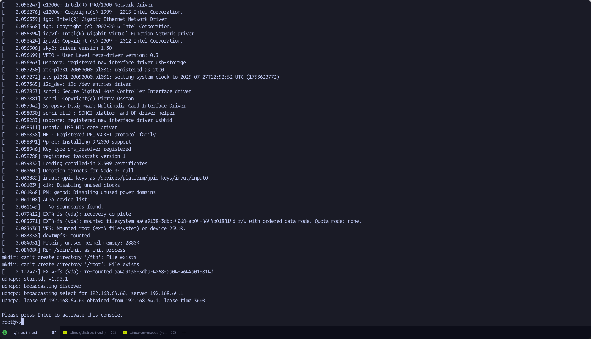

# linux-on-macos
130+ lines of swift code to implement a linux virtual machine. You can use it to run a ubuntu cloud image , arch linux(arm64) or opensource linux kernel and busybox root fs. Currently it works on Apple silicon M2. 

Features provided:

- NAT network with DHCP
- Sharing directory between host and guest
- ssh or telnet accessing
- ftp / sftp service

- configuration
  - number of cpus
  - memory size
  - network
  - multiple sharing directories
- distros
  - ubuntu 25.04 cloud image
  - arch linux arm
  - busybox and kernel.org linux


## download submodules

```bash
git submodule update --init --recursive
```


# Usage

```bash
## build
make

## init distro images
wget https://github.com/ticktechman/oss-img/releases/download/v0.1/oss-img.tar.xz
tar Jxvf oss-img.tar.xz

## change oss.json
cat oss.json
{
  "cpus": 2,
  "memory": 2048,
  "kernel": "./oss-img/Image",
  "initrd": "",
  "storage": ["./oss-img/root.img"],
  "cmdline": "console=hvc0 root=/dev/vda rw init=/sbin/init",
  "shared": ["shared"],
  "network": true
}

## run 
./linux oss.json


```

screen shot like this:



Simple and super fast~


If you want to run ubuntu and archlinx, please goto [distros](distros.md). There are scripts to build the image files. After that, change the path in ubuntu.json and arch.json.

```json
cat ubuntu.json
{
  "cpus": 2,
  "memory": 2048,
  "kernel": "./distros/ubuntu/vmlinux",  // HERE
  "initrd": "./distros/ubuntu/initrd.img", //HERE
  "storage": ["./distros/ubuntu/root.img", "./distros/ubuntu/seed.iso"], //HERE
  "cmdline": "console=hvc0 root=/dev/vda1 rw",
  "shared": ["shared"],
  "network": true
}

cat arch.json
{
  "cpus": 2,
  "memory": 2048,
  "kernel": "./distros/arch/vmlinux",    //HERE
  "initrd": "./distros/arch/initrd.img", // HERE
  "storage": ["./distros/arch/root.img"], // HERE
  "cmdline": "console=hvc0 root=/dev/vda rw",
  "shared": ["shared"],
  "network": true
}
```


To launch a ubuntu vm: `./linux ubuntu.json` and arch linux VM: `./linux arch.json`
